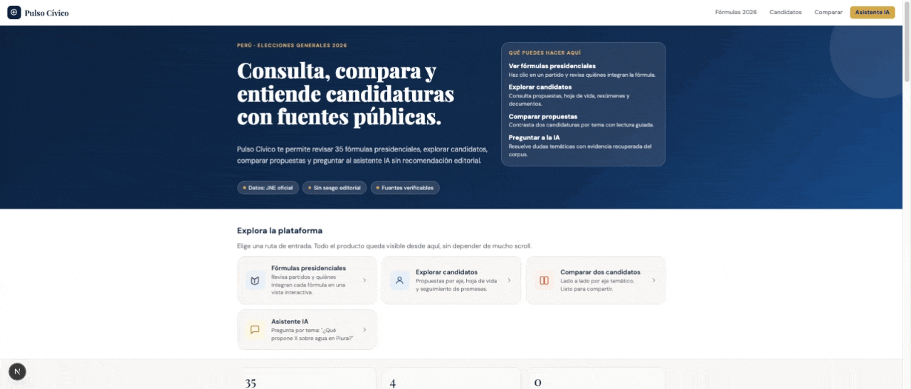

# Pulso Cívico

Plataforma de voto informado con IA, comparación de candidaturas presidenciales y evidencia documental a partir de fuentes públicas del JNE.

[](./frontend)
[](./backend)
[](https://www.postgresql.org/)
[](https://www.trychroma.com/)
[](./docker-compose.yml)
[](./LICENSE)

Pulso Cívico toma documentos públicos complejos y los convierte en una experiencia más clara para ciudadanía general. El proyecto combina una interfaz de consulta electoral, un comparador de propuestas, un asistente IA con fuentes y páginas, y un pipeline de ingestión de planes de gobierno y hojas de vida estructuradas.

## Demo

- Frontend local: `http://localhost:3000`
- API local: `http://localhost:8000/api`
- Documentación técnica adicional: [docs/ARCHITECTURE.md](./docs/ARCHITECTURE.md)
- Guía de screenshots y GIFs: [docs/SHOWCASE.md](./docs/SHOWCASE.md)

## Preview

### Comparador guiado



### Perfil de candidatura


### Asistente IA con evidencia


## Why This Project Matters

Los portales oficiales suelen ganar en cobertura, pero no necesariamente en claridad de uso. Pulso Cívico se enfoca en tres diferenciales de producto:

- comparación guiada entre candidaturas sin convertir la experiencia en ranking editorial;
- consulta asistida con IA, evidencias, páginas y vacíos explícitos;
- explotación estructurada de datos públicos del JNE para fichas más útiles y comparables.

## Features

- Comparador de candidaturas presidenciales con lectura guiada por tema.
- Asistente IA con fuentes, páginas y señalización de evidencia, inferencia y ausencia de hallazgos.
- Fichas de candidaturas con fotos, partido, plan de gobierno, hoja de vida y resumen neutral.
- Exploración de fórmulas presidenciales completas.
- Ingesta local de planes de gobierno, metadatos oficiales y hojas de vida del JNE.
- Persistencia de datos en PostgreSQL y búsqueda semántica en ChromaDB.
- Flujo Docker listo para desarrollo local.

## Stack

### Frontend

- Next.js 15
- React 19
- TypeScript

### Backend

- FastAPI
- SQLAlchemy
- PostgreSQL
- ChromaDB
- OpenAI / Groq
- PyPDF, BeautifulSoup, lxml

### Data Pipeline

- Descarga e ingestión de planes de gobierno
- Indexación RAG con metadata por página
- Normalización de hojas de vida de presidente y vicepresidencias

## Architecture

```text
frontend (Next.js)
  -> backend/api (FastAPI)
    -> PostgreSQL (candidatos, propuestas, fórmulas, hojas de vida)
    -> ChromaDB (chunks RAG con metadata de página)
    -> proveedores LLM (OpenAI / Groq)
    -> corpus local del JNE y planes de gobierno
```

Más detalle: [docs/ARCHITECTURE.md](./docs/ARCHITECTURE.md)

## Repository Structure

```text
.
├── backend/                  # API, modelos, servicios, scripts de ingestión
├── frontend/                 # App Next.js y componentes UI
├── docs/                     # Arquitectura, showcase y documentación de repo
├── docker-compose.yml        # Orquestación local
├── PLAN_DESARROLLO.md        # Roadmap de producto
└── PROPUESTA_IA_PULSO_CIVICO.md
```

## Quick Start

### 1. Clonar el repositorio

```bash
git clone https://github.com/fcamabeltran/pulso-civico.git
cd pulso-civico
```

### 2. Preparar variables de entorno

```bash
cp backend/.env.example backend/.env
cp frontend/.env.example frontend/.env.local
```

Configura al menos una credencial LLM en `backend/.env`:

- `OPENAI_API_KEY`
- o `GROQ_API_KEY`

### 3. Levantar el entorno con Docker

```bash
docker compose up --build
```

Servicios principales:

- `web`: `http://localhost:3000`
- `api`: `http://localhost:8000`
- `db`: PostgreSQL 16 en `localhost:5432`

## Local Development

### Frontend

```bash
cd frontend
npm install
npm run dev
```

### Backend

```bash
cd backend
python3 -m venv .venv
source .venv/bin/activate
pip install -r requirements.txt
uvicorn app.main:app --reload
```

## Data and Ingestion

El proyecto trabaja con documentos públicos descargados e indexados localmente. Los flujos principales viven en `backend/app/scripts/`.

Casos comunes:

- descargar o actualizar planes de gobierno;
- reindexar el corpus RAG en ChromaDB;
- importar hojas de vida estructuradas del JNE;
- reconstruir candidatos, propuestas y metadatos de fórmula.

La indexación guarda `page_number` cuando está disponible, lo que permite mostrar páginas en el módulo de evidencia del asistente IA.

Nota para publicación del repositorio:

- `backend/data/` y `backend/chroma/` se regeneran localmente y no deberían formar parte del repo público;
- el repositorio debe incluir código, documentación y assets de showcase, no el corpus pesado completo.

## Environment Variables

Variables relevantes del backend:

- `APP_ENV`
- `DEBUG`
- `POSTGRES_SERVER`
- `POSTGRES_PORT`
- `POSTGRES_USER`
- `POSTGRES_PASSWORD`
- `POSTGRES_DB`
- `CHROMA_PATH`
- `RAG_COLLECTION_NAME`
- `RAG_TOP_K`
- `LLM_PROVIDER`
- `OPENAI_API_KEY`
- `OPENAI_MODEL`
- `GROQ_API_KEY`
- `GROQ_MODEL`

Variable relevante del frontend:

- `NEXT_PUBLIC_API_URL`

Ver ejemplos en:

- [backend/.env.example](./backend/.env.example)
- [frontend/.env.example](./frontend/.env.example)

## Documentation

- [docs/ARCHITECTURE.md](./docs/ARCHITECTURE.md): arquitectura y flujos principales
- [docs/SHOWCASE.md](./docs/SHOWCASE.md): qué screenshots y GIFs subir al repo
- [backend/README.md](./backend/README.md): detalles del backend
- [frontend/README.md](./frontend/README.md): detalles del frontend

## Ethical and Editorial Notes

- Pulso Cívico no recomienda por quién votar.
- La comparación es descriptiva, no evaluativa.
- El asistente IA separa evidencia, inferencia y ausencia de hallazgos.
- Las respuestas dependen del corpus cargado localmente y de la calidad de extracción/indexación.
- Las fuentes primarias provienen de documentos públicos del JNE y planes de gobierno.

## Roadmap

Prioridades actuales:

1. Mejorar ranking de evidencia y recuperación temática.
2. Consolidar visualización de hoja de vida y fórmulas presidenciales.
3. Fortalecer comparaciones compartibles y resumen editorial neutral.
4. Pulir documentación pública y demo visual del repositorio.

La visión detallada está en [PLAN_DESARROLLO.md](./PLAN_DESARROLLO.md).

## Publishing This Repo Well

Para que el repositorio funcione como portfolio técnico, conviene subir en este orden:

1. GIF del comparador guiado.
2. GIF del perfil de candidatura.
3. GIF del asistente IA con evidencia.

Checklist completo: [docs/SHOWCASE.md](./docs/SHOWCASE.md)

## Contributing

Las contribuciones son bienvenidas. Revisa [CONTRIBUTING.md](./CONTRIBUTING.md) para pautas de desarrollo, estilo y PRs.

## License

Este proyecto se distribuye bajo licencia [MIT](./LICENSE).
